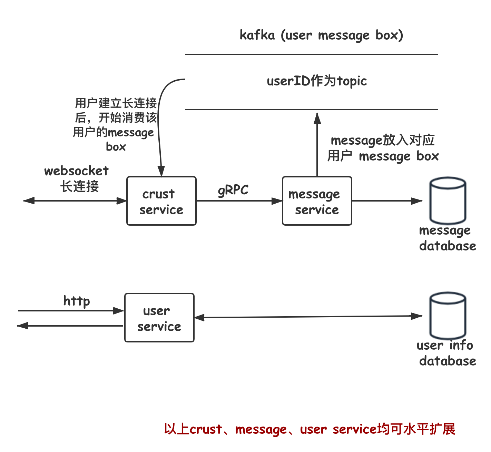

# nowim

## 架构设计



后台分为三个service：
- user service，提供用户相关的服务，包括注册用户、添加好友、查找好友、用户鉴权等。
- crust service，消息系统的外层服务，维持和客户端之间的websocket长连接，并且从对应用户的message box（即userID对应的topic）中消费消息，推送给用户。
- message service，负责消息的主要逻辑处理，包括存库、排序等，完成后将消息放入消息收取方的message box。

## 数据结构设计

message in:
```json
{
    "userID": 123,
    "content": "hello world hello world",
    "clientTime": 1591681235
}
```

message out:
```json
{
    "messageID": "xxx",
    "senderID": 123,
    "receiverID": 321,
    "content": "hello world hello world",
    "clientTime": 1591681235,
    "serverTime": 1591681444
}
```

user in table:
```json
{
    "userID": 1,
    "userName": "lalala"
}
```
